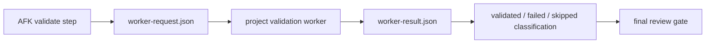
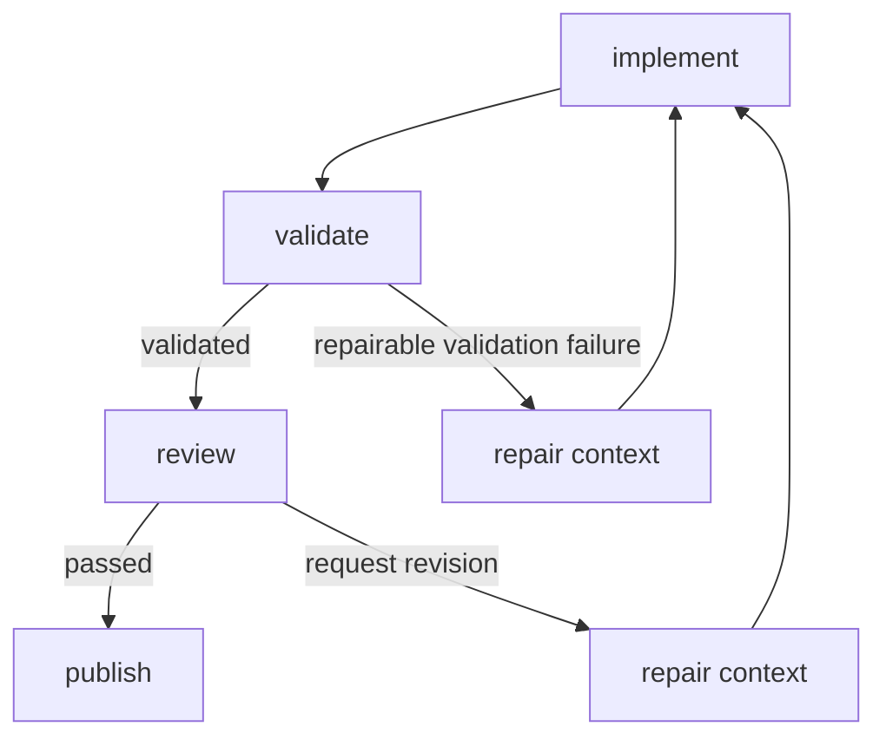
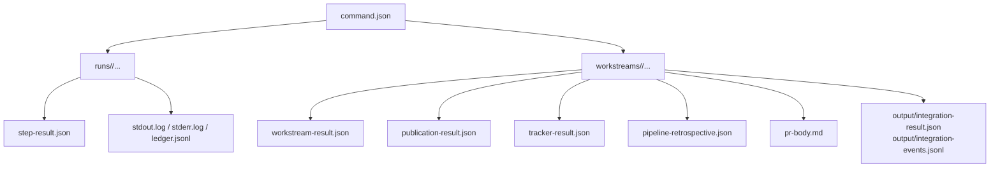
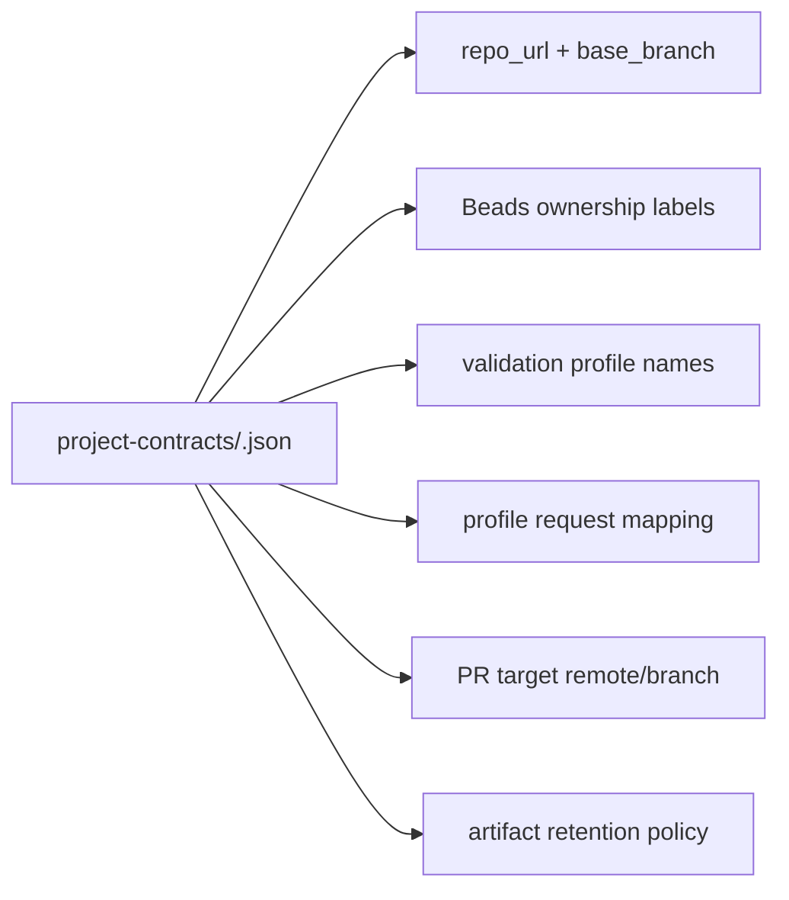

# AFK Pipeline Overview

This guide explains the current AFK pipeline as it exists in this repo today.
It is written against the runtime surfaces in `README.md`, `src/afk/*.py`,
`project-contracts/*.json`, and the CLI tests.

It intentionally separates:

- the current minimal runtime path, which stops after PR publication; from
- the shipped post-publication integration classifier, which inspects published
  PR state without merging or closing; from
- later merge/close and terminal retrospective work.

If a behavior appears in tests or legacy code paths but is not part of the
current documented minimal contract, this guide calls that out as a note or
TODO instead of presenting it as settled runtime behavior.

## Scope

Today the composed AFK workstream owns:

- work selection;
- checkout preparation;
- implementation execution;
- final validation;
- final review plus bounded repair loops;
- PR publication;
- ledger/evidence emission;
- tracker state projection for "what remains open".

Today the minimal runtime does not own:

- waiting for external checks after PR publication;
- merging the exact validated head as a first-class current contract;
- closing the source tracker item after merge;
- running a terminal retrospective worker after merge/no-merge.

Today the repo also includes a separate post-publication classifier via
`afk integrate-pr` / `src/afk/integration.py`. It consumes a published
workstream/publication artifact, classifies PR/head/check state, and writes
integration artifacts without merge/close behavior.

Those later merge/close responsibilities are the seam described by the
2026-07-06 spike in
`~/Documents/rmd/Ceremonies/Personal Work/spikes/2026-07-06-afk-integration-merge-phase.md`
and by Bead `central-umi2.1`.

## End-To-End Flow

```mermaid
flowchart LR
  Contract[Project contract] --> Select
  Tracker[Beads / GitHub Issues / fixture sources] --> Select

  Select[select-work]
  Select --> Checkout[prepare-checkout]
  Checkout --> Implement[implement]
  Implement --> Validate[validate]
  Validate --> Review[review]
  Review --> Publish[publish PR]

  Validate -. repair context .-> Implement
  Review -. repair context .-> Implement

  Publish --> Published[published / tracker still open]
  Published --> Integrate[afk integrate-pr classifier]
  Integrate --> Artifacts[integration-result.json<br/>integration-events.jsonl]
  Artifacts -. later seam .-> Close[merge exact head + close tracker]
  Close --> Retro[terminal retrospective]
```

The important boundary is after `publish PR`: the current runtime emits evidence
for that state, and the repo can now classify the published PR afterward, but
it does not yet treat merge/close as the default finished path.

## Phase Walkthrough

### 1. Selection

`select-work` normalizes candidates from fixture, GitHub Issues, and Beads
sources into one `WorkSelection` result.

Current selection behavior:

- tries every configured source instead of failing fast on one unavailable
  source;
- records source status evidence for skipped/unreachable sources;
- chooses work that is ready and not blocked by dependency state;
- can skip work already represented by an open target PR when the surrounding
  recipe/run-next flow has enough target-repo context to prove that.

Operationally, selection is where AFK maps tracker items into pipeline work. It
does not start cloning or editing code yet.

### 2. Checkout Preparation

`prepare-checkout` creates or reuses a real checkout inside an explicit absolute
`checkout_root`.

It records:

- repo URL and requested base ref;
- checkout path and review branch;
- start commit;
- dirty-tree status;
- submodule SHAs;
- optional branch publication evidence for the prepared `afk/*` branch.

The step is conservative by design:

- dirty existing checkouts are refused;
- a reused checkout must match the expected `origin`;
- the checkout path must stay under the declared root mount.

This is the phase that turns a selected tracker item into a reproducible git
workspace.

### 3. Implementation

`implement` consumes:

- the normalized selected work item;
- the prepared checkout metadata;
- guardrails;
- validation hints;
- a configured Pi/agent adapter.

It writes a `job-capsule.json` that carries the work context and the current
checkout state into the implementation adapter. After the adapter runs, AFK
records:

- normalized adapter output in `agent-result.json`;
- git metadata before and after implementation;
- changed files and produced commits;
- runtime classification for adapter failure vs target-code failure.

The implementation step does not decide that the work is done. It only produces
candidate code plus evidence for what changed.

### 4. Validation

`validate` is the target-facing seam.

AFK owns:

- shaping the worker request;
- invoking a local or remote validation adapter;
- recording the worker request/result artifacts;
- normalizing validation status for the rest of the pipeline;
- preserving actionable failure excerpts and log pointers.

The target project owns:

- what each validation profile means;
- stack/harness/build/test semantics;
- lock behavior and long-running validation details;
- target-specific evidence layout.

This is where project contracts matter most: the contract maps AFK profile
names such as `tier1` or `tier3-harness` to target-owned worker request
profiles.

### 5. Review And Repair

`review` builds a final evidence pack from:

- work item acceptance criteria;
- checkout metadata;
- implementation git metadata;
- required validation artifacts;
- guardrail results;
- cleanup status;
- redaction metadata.

The reviewer result is normalized to one of:

- `passed`;
- `failed`;
- `request_revision`.

If the recipe enables review feedback and the findings are repairable, AFK
injects another bounded loop through checkout/implementation/validation/review.

### 6. Shared Repair Loop

Validation and review can both feed the same repair machinery.

The repair loop is bounded by `repair_policy` or legacy retry settings. AFK
records retry attempts, retry budget state, and dirty retry checkout evidence
instead of silently spinning forever.

### 7. Publication

Publication is the current terminal runtime action.

Before AFK publishes, it requires:

- final validation evidence for the implemented HEAD; and
- a passed final review for that same HEAD.

Publisher behavior today:

- validates GitHub auth with a minimal scrubbed environment;
- optionally pushes the review branch;
- creates or updates a PR;
- writes `pr-body.md` before running `gh`;
- emits `publication-result.json` with explicit terminal state.

The documented terminal publication states for the minimal path are:

- `published`
- `validated-unpublished`
- `blocked`
- `failed-needs-human`

When the status is `published`, the source tracker item still remains open. That
is where the composed workstream stops today.

### 8. Post-Publication Integration Classification

After publication, the repo now includes a standalone terminal integration
classifier:

- CLI entrypoint: `afk integrate-pr`
- implementation: `src/afk/integration.py`
- input: `publication-result.json` or `workstream-result.json`
- output: `output/integration-result.json` plus
  `output/integration-events.jsonl`

Its job is narrow on purpose:

- read the published artifact and recover repo, PR number, and expected HEAD;
- query GitHub for the live PR head and status checks;
- classify the state as pending, failed, inconclusive, blocked, or
  merge-ready;
- write deterministic integration artifacts for a later operator or worker.

It does not currently:

- merge the PR;
- close the source tracker item;
- write the terminal retrospective;
- extend the composed `run-workstream` contract past `published`.

## Evidence And Ledgers

Every step writes a normal run ledger, and `run-workstream` also writes a
composed workstream ledger.

The workstream ledger is the operational summary:

- `workstream-result.json` ties step outputs together;
- `publication-result.json` tells you whether AFK could publish;
- `tracker-result.json` tells you whether the source item is still open and why;
- `pipeline-retrospective.json` records deterministic process feedback;
- `output/integration-result.json`, when present, records post-publication
  PR/head/check classification;
- `retrospective.json`, when present, stores user-supplied terminal evidence.

In practice, the workstream ledger is the handoff package for any later
publication-resume, integration, or retrospective worker.

## Where Project Contracts Fit

Project contracts provide the stable project facts AFK needs without teaching
AFK target-specific behavior.

Today the contract surface covers:

- project slug identity;
- repo/base branch;
- Beads ownership labels;
- AFK validation profile names;
- target validation request mapping;
- artifact retention values;
- PR target remote/branch.

It does not yet document a first-class terminal integration policy. That is a
follow-up seam, not something to infer implicitly from publication behavior.

## Tracker And Retrospective Boundaries

`tracker-result.json` is the current projection of tracker state, not proof that
the tracker item has been closed.

For the minimal runtime:

- a published PR usually means tracker status is still effectively
  `awaiting-review`;
- review-cycle evidence can advance the tracker projection to
  `review-findings-open` or `review-feedback-addressed`;
- merge/no-merge remains an external terminal decision unless a future terminal
  worker records it explicitly.

`pipeline-retrospective.json` is always produced and is deterministic. It is
pipeline feedback about the run itself, not a merge/closure retrospective.

The terminal retrospective described in the merge-phase spike is a later
artifact family that should run after a real terminal decision exists.

## Current Notes And TODOs

1. Current default runtime stop

   The documented minimal path stops at `published`. AFK emits enough evidence
   for later post-publication steps, but the composed workstream does not yet
   own merge/close behavior.

2. Current integration classifier

   `afk integrate-pr` already ships as a standalone classifier for published
   workstream/publication artifacts. It observes PR/head/check state and writes
   integration artifacts, but intentionally stops short of merge/close.

3. Merge/close seam

   The next intended seam is to build on that classifier with exact-head merge,
   source-item closure, and terminal retrospective behavior. That is the focus
   of the `central-umi2` line of work.

4. Historical close-mode code and tests

   This repo still contains `publisher.mode == "close"` paths and tests for
   merge plus source-item closure. The current README and active spike position
   treat post-publication integration as a separate seam, so those older
   close-mode surfaces should be read as historical or transitional
   implementation detail until the current integration contract is fully
   documented and extended.

5. Contract gap

   Project contracts currently encode validation and PR-target facts, but not a
   dedicated terminal integration/check policy surface. Document that policy in
   contracts before treating post-publication integration as generic runtime
   behavior.

## Operational Reading Order

When debugging or operating the pipeline, read artifacts in this order:

1. `workstream-result.json`
2. `publication-result.json`
3. `tracker-result.json`
4. `pipeline-retrospective.json`
5. step-specific `runs/<run-id>/step-result.json`

That sequence tells you:

- what AFK attempted;
- whether the implemented HEAD reached final gates;
- whether publication succeeded;
- whether post-publication classification has already been recorded;
- why the tracker item is still open;
- whether the next action belongs in implementation, publication resume,
  integration classification, or a later merge/close phase.
